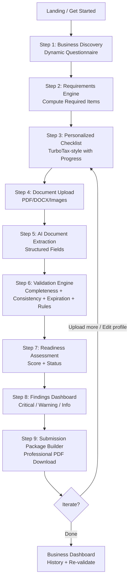
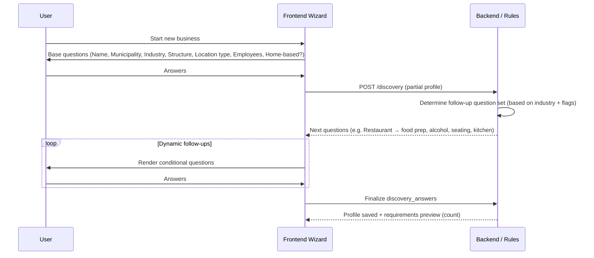

# SmartPR User Flows & Diagrams

All flows are strictly **readiness assessment**. No language or UI element implies government approval.

## Overall Wizard Flow (9 Steps as per Product Vision)



## Step 1 — Business Discovery (Dynamic)



**Dynamic Follow-up Examples** (implemented in frontend + backend suggestion):
- Restaurant / Food Service: Indoor seating? Alcohol? Commercial kitchen? Food preparation on premises? Catering?
- Medical / Healthcare: Provider type (MD, dentist, therapy, lab)? Number of licensed professionals on staff? Controlled substances?
- Construction / Contractor: Trade (general, electrical, plumbing)? Bonding/insurance levels? Public projects?
- Retail: Alcohol/tobacco? Pharmacy? Firearms? Prepared food?
- Professional Services (law, accounting, engineering, architecture): Which professions? Will you maintain client records on site?
- Home-based: Will clients visit? Signage? Storage of inventory/hazardous materials? % of home used?

All questions have bilingual labels + help text with examples.

## Step 2-3 — Requirements → Checklist

After discovery:
- Backend materializes `business_requirements` via rules engine.
- Frontend renders grouped checklist:
  - By agency (Hacienda, OGPe/SBP, Salud, Bomberos, Municipality, Professional Board, Other)
  - Or by category (Core Entity, Tax/Registration, Location/Use, Health & Safety, Professional, Supporting Docs)
- Progress bar = (mandatory completed / mandatory total)
- "Critical path" items surfaced first.
- Estimated time remaining (heuristic: 2-5 days per major permit + buffer).
- "Why is this required?" links to citation / plain explanation.

**State Machine for Checklist Item** (per requirement):
```
pending (not uploaded / not validated)
  → uploaded (doc linked but not yet validated)
  → validating (AI running)
  → passed | warning | failed
```

User can mark "I will obtain this later" (still counts as incomplete for score).

## Step 4-5 — Upload + Extraction

```mermaid
flowchart LR
    Upload[Drag & Drop or Browse<br/>Multiple files] --> Queue[Client + Backend Queue]
    Queue --> Storage[Supabase Storage<br/>Private Bucket]
    Storage --> Metadata[documents table + sha256]
    Metadata --> Job[Background: AI Extraction]
    Job --> OpenRouter[OpenRouter<br/>Vision + Structured Output]
    OpenRouter --> Normalize[Normalize fields<br/>business_name, dates, ids, addresses]
    Normalize --> Store[document_extractions JSONB]
    Store --> UI[Update checklist item status<br/>Show extracted summary card]
```



**Extraction Schema (Pydantic / JSON)**
```json
{
  "business_name": "...",
  "entity_name": "...",
  "address": { "street": "...", "city": "San Juan", ... },
  "owner_or_officers": ["..."],
  "issue_date": "2024-...",
  "expiration_date": "2025-...",
  "license_or_permit_number": "...",
  "tax_id_or_ein": "...",
  "issuing_agency": "...",
  "document_type_confidence": 0.92
}
```

User sees extracted values in a review panel and can correct before validation (corrections logged).

## Step 6 — Validation Engine (Multi-Pass)

1. **Completeness Pass**: For every mandatory `business_requirements` without a linked "passed" document → Critical finding.
2. **Consistency Pass** (cross-document):
   - Entity name on Inc vs Insurance vs Merchant Reg (fuzzy + exact match, flag significant mismatch).
   - Address consistency.
   - EIN / Tax ID match.
   - Owner names.
3. **Expiration Pass**: Any doc with expiration within N days (configurable: 30/60/90) → Warning. Past expiration → Critical.
4. **Business Rules Pass**: Re-apply relevant `requirement_rules` + domain logic (e.g. restaurant must have both health + fire; if alcohol then additional; home-based cannot have certain high-risk activities without variance).
5. **Dependency Pass**: If dependent item is missing prerequisite → Informational or Warning.

All findings are written to `findings` table with full evidence pointers.

## Step 7-8 — Readiness Score + Findings

**Score Formula (MVP, tunable)**:
```
Score = 100
  - (Critical findings × 15) capped at 60
  - (Warning findings × 5)
  - (Missing mandatory % × 0.4 weight)
  - (Consistency/expiration penalties)
Min 0, Max 100. Display as integer.
```

**Status Labels** (never approval language):
- 90–100: "Ready for Submission — Strong"
- 75–89: "Mostly Ready — Address Warnings"
- 60–74: "Needs Work — Critical Items Outstanding"
- <60: "Not Ready — Multiple Gaps"

**Findings Dashboard**:
- Grouped by Severity (red/orange/blue)
- Each card: Title, Description (bilingual), Evidence (doc thumbnail + extracted snippet + rule), Recommended Action, Agency.
- "Mark as Addressed" (for user tracking; does not remove from score until re-validated with evidence).

## Step 9 — Submission Package Builder

User clicks "Generate Submission Package".

Backend:
- Takes latest validation_run + all linked documents + profile + current rule versions.
- Renders professional PDF (WeasyPrint/ReportLab template):
  - Cover with business name, date, readiness score, disclaimer (large, bold).
  - Executive Summary.
  - Required Licenses & Permits (by agency, with status).
  - Document Checklist (with included files + hashes).
  - Validation Findings (Critical first).
  - Extracted Data Summary (table).
  - Recommendations & Next Steps.
  - Full index of supporting documents (with storage references for auditor).
- Stores PDF + metadata in `submission_packages`.
- Provides download link + "View previous packages".

**Package is a snapshot** — re-generating after changes produces a new version with new timestamp and score.

## Re-validation & Iteration Flow

Any change (new upload, profile edit, rule update activation) offers "Re-validate now". Creates new `validation_run`.

History view shows score trend over time (encourages improvement).

## Error / Edge Case Flows
- AI extraction low confidence → "Review extracted data" + manual override option + "Request human review" (future support ticket).
- Conflicting documents → Strong consistency finding + "Upload corrected version or add explanation".
- Municipality not yet in detailed rules → Fall back to general + prominent "Verify with [Municipality] Planning Office" informational finding.
- No documents uploaded but profile complete → Checklist shows all pending + "Start with Core Registrations" guidance.

## Accessibility & Bilingual Notes
- Every screen has language toggle (persistent).
- All diagrams and flows have equivalent text descriptions.
- Stepper is keyboard and screen-reader friendly.
- Progress announcements for assistive tech.

## Future "Submit" Flow (Architecture Only)
When SBP/OGPe APIs exist:
```
Package + User Consent + Scoped Auth Token
  → Adapter layer (SmartPR or partner)
  → Agency pre-validation endpoint (if offered)
  → Submission receipt + tracking ID stored back in SmartPR
```
SmartPR remains the readiness layer; submission is a thin, auditable hand-off.

---
**All user-facing copy, button labels, findings, and PDF content must pass a "readiness language" linter before release.**
